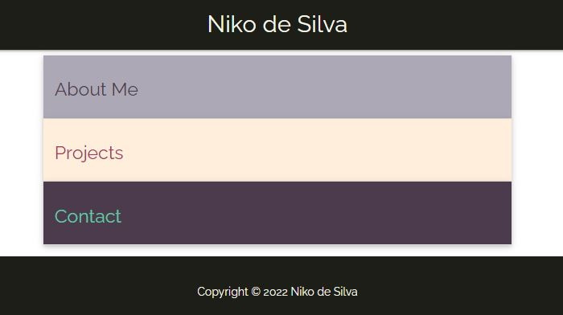
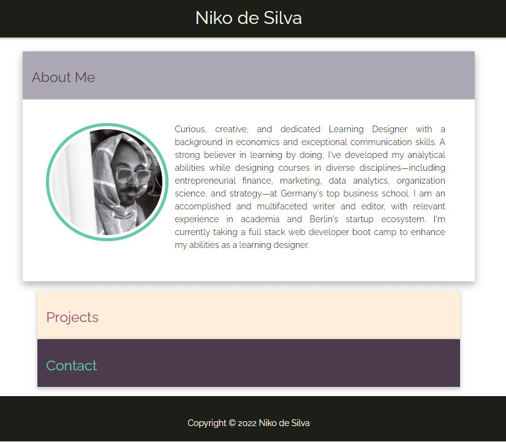
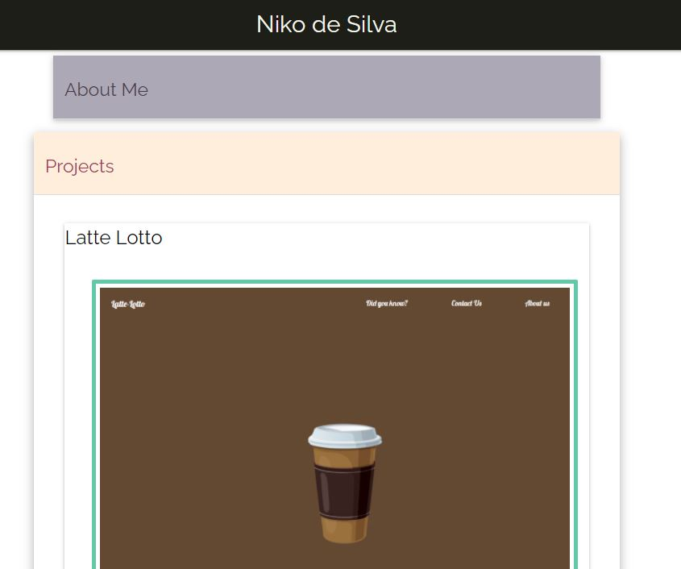
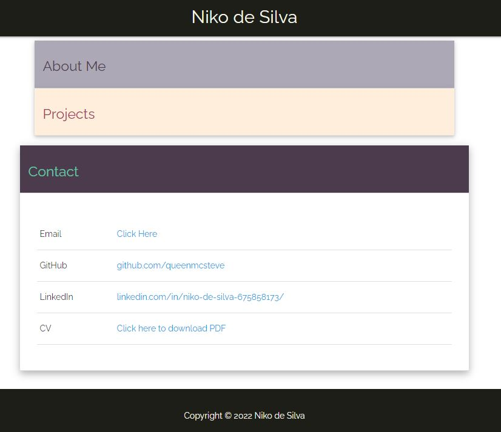

# Portofolio

## Description:

A simple portfolio website.

## Table of contents:

- [Screenshots](#screenshots)
- [Demo](#demo)
- [Technologies](#technologies)
- [Contributing](#contributing)
- [Contact](#contact)
- [License](#license)

# Screenshots

Landing page

About Me

Projects

Contact

# Demo

See the deployed page [here](https://queenmcsteve.github.io/portfolio_2022/).

# Technologies

This page uses HTML, CSS, and [Materialize](https://materializecss.com/).

# Contributing

Not accepting contributions.

# Contact

If you have any questions you can reach me via:

- Github: [queenmcsteve](https://github.com/queenmcsteve)
- Email: [queen.mcsteve.666@gmail.com](mailto:queen.mcsteve.666@gmail.com)

# License

[This project is licensed under the terms of the MIT license.](https://opensource.org/licenses/MIT)
